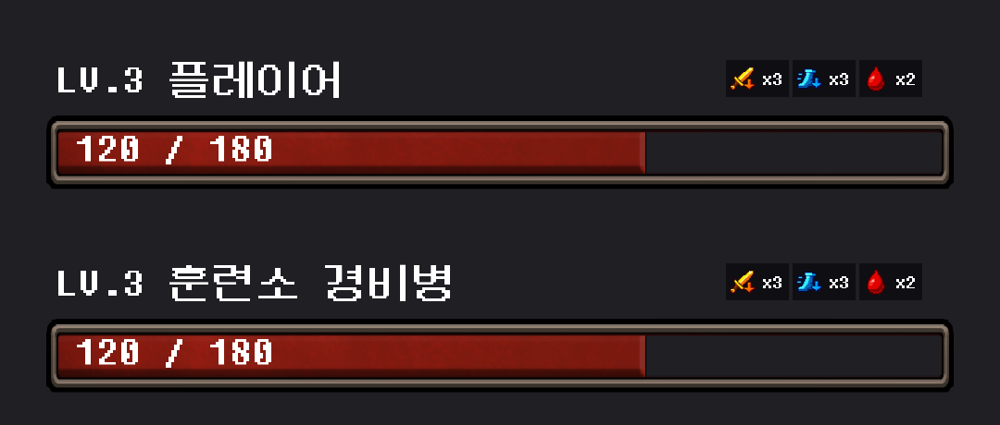

# 상태효과 생성 아이콘 적용

## 결과

`generate2dsprite` 스킬과 내장 이미지 생성 도구로 만든 아이콘 3종을 플레이어·적 이름표에 적용했다. 기존 도형 그리기는 생성된 스프라이트를 표시하는 방식으로 교체했다.

| 상태효과 | 모양 | 프로젝트 파일 |
| --- | --- | --- |
| 출혈 | 붉은 핏방울 | `Assets/Resources/UI/StatusEffects/bleeding.png` |
| 공격력 감소 | 금빛 검 + 아래 화살표 | `Assets/Resources/UI/StatusEffects/attack-down.png` |
| 회피율 감소 | 푸른 장화 + 아래 화살표 | `Assets/Resources/UI/StatusEffects/dodge-down.png` |

모두 32×32 투명 PNG다. Point 필터, 밉맵 없음, 무압축, Sprite Single로 Unity에서 임포트했다. `CharacterEffectIcon`이 Resources에서 효과별 이미지를 불러오고 플레이어·적이 공유한다. 원본 색상과 비율을 유지하며 마우스 입력은 가로채지 않는다.

남은 턴 `x2` 표시, 만료 시 숨김, 인벤토리 전투 차단은 유지했다. 추가 Inspector 연결은 필요 없다. SO·구글 시트·저장 데이터는 변경하지 않았다.

## 생성 기록

- 방식: 내장 `image_gen`으로 원본 생성 → 스킬의 `generate2dsprite.py process`로 배경 제거·3칸 분리·크기 정리.
- 프롬프트: [사용한 전체 프롬프트](Generated/StatusEffects-20261006/prompt-used.txt)
- 원본·투명 시트·검사 메타데이터: `Docs/AI/Generated/StatusEffects-20261006/processed/`
- 원본 생성일은 10월 6일, UI 연결 완료일은 10월 7일이다.
- 서로 다른 정적 아이콘 묶음이다. 처리기가 만든 GIF는 게임에서 사용하지 않는다.

## 검증

- 이미지 검사: 3개 모두 빈 프레임·테두리 잘림·배치 잘림 없음.
- Unity Edit Mode 검사 61개 통과: 효과 적용/턴 감소/초기화, 인벤토리 차단, 스프라이트 매핑·색상·비율·필터 확인.
- Unity 콘솔 오류 0개.
- 실제 Player/Enemy 프리팹을 격리된 미리보기 씬에 복제하여 표시 확인.
- Play Mode는 실행하지 않았으며 실제 세이브·사용자 씬을 저장하지 않았다.

